# Projekt z Podstaw Sztucznej Inteligencji - uczenie maszynowe

- Rafal Babinski
- Roman Moskalenko

## Treść zadania `RB.ML12 Grzyby NN`
Przewidywanie czy [grzyb](https://archive.ics.uci.edu/ml/datasets/mushroom) jest jadalny przy użyciu własnej implementacji prostej sieci neuronowej.

## Interpretacja zadania
Mamy pełną swobodę w zaimplementowaniu sieci neuronowej. Wykorzystując podany wcześniej zbiór danych, musimy przeanalizować które komponenty sieci i jakie podejście przy jej budowaniu zapewni jak największą efektywność.

## Wkład poszczególnych autorów

Rafal Babinski
- Przygotowanie zbioru danych do przetwarzania
- Implementacja klasy perceptronu
- Implementacja K-krotnej walidacji krzyżowej
- Generowanie dokumentacji

Roman Moskalenko
- Implementacja klasy perceptronu
- Generowanie wykresów
- Prowadzenie eksperymentów

## Decyzje projektowe i przeprowadzone badania
**Decyzje wstępne**

- Wybraliśmy do zaimplementowania prosty lecz efektywny typ sieci neuronowej: perceptron dwuwarstwowy
- Jako szablon wstępny wybraliśmy sieć neuronową opisaną w [tym artykule](https://towardsdatascience.com/how-to-build-your-own-neural-network-from-scratch-in-python-68998a08e4f6).
- Uczenie sieci będzie przeprowadzać się z nadzorem.
- Przekodowaliśmy podany zbiór danych na *kod 1 z n* dla zapewnienia działania sieci.
- Arbitralnie wybraliśmy liczbę neuronów w warstwie ukrytej - 2.
- Arbitralnie wybraliśmy funkcję aktywacji - sigmoid.
- Inicjalizacja wag każdego neuronu odbywa się losowo.
- Wartości parametrów bias jest zerowa.
- Stworzyliśmy zbiór danych kontrolnych, 100 wybranych losowo próbek z podanego
 zbioru. Na nim będziemy testować efektywność sieci.
 
**Badanie wstępne**

- Uruchomiono po raz pierwszy sieć neuronową. 
- Przez 100 iteracji sieć uczyła się na całym zbiorze danych.
- Przetestowano na losowo wybranych 100 próbkach.

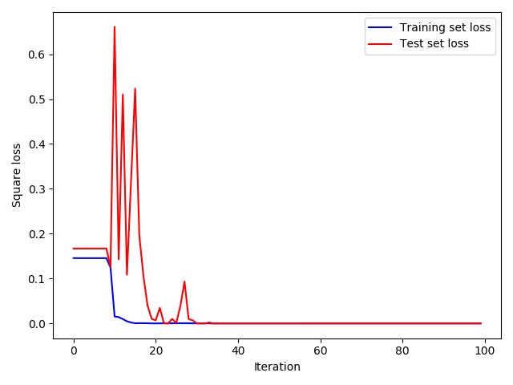

- Przez pierwsze 30 iteracji możemy zaobserwować dużą stratę na zbiorze walidacyjnym (czerwona linia).
- Po czym następuje prawie zerowa strata. Mamy podejrzenie, że sieć dopasowała się do danych (przeuczenie sieci).

**Podział zbioru danych na treningowy i testowy**

Aby zapobiec przeuczeniu sieci dzielimy dane na dwa zbiory: zbiór treningowy - uczymy na nim sieć, oraz zbiór testowy - 
na tym zbiorze sprawdzamy efektywność działania sieci.
- Podział danych na treningowe i testowe w stosunku 1:1

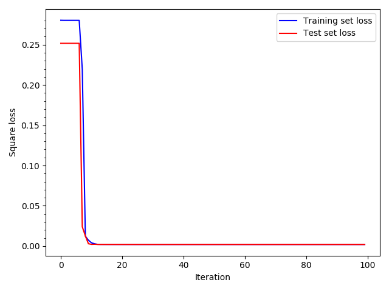

- Już na 13 iteracji strata na zbiorze testowym osiągnęła 0.002 i utrzymywała się taka w przeciągu pozostałych iteracji.

**Zależność straty od liczby neuronów i podziału danych**

Badamy jak zmienia się strata na zbiorze testowym w zależności od liczby neuronów i stosunku liczności zbioru
treningowego do liczności zbioru testowego.

Straty po 100 iteracjach uczenia

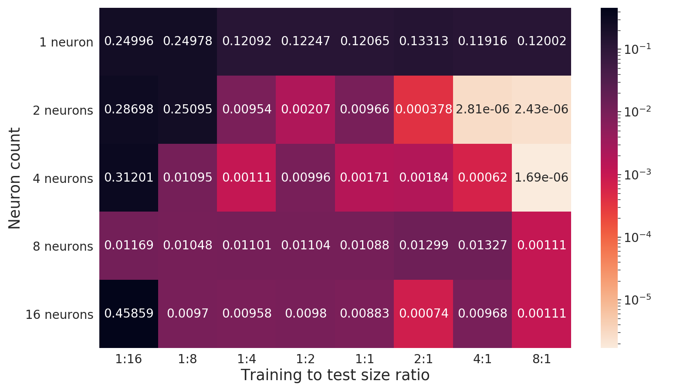

<!--
| | 1:16 | 1:8 | 1:4 | 1:2 | 1:1 | 2:1 | 4:1 | 8:1 |
|---|---|---|---|---|---|---|---|---|
| 1 | 0.24996987 | 0.24978884 | 0.1209201 | 0.12247378 | 0.12065256 | 0.13313197 | 0.11916315 | 0.12001857 |
| 2 | 0.28698771 | 0.25095842 | 0.00954373 | 0.00207549 | 0.00966817 | 3.7384e-04 | 2.80576709e-06 | 2.42590592e-06 |
| 4 | 0.31201701 | 0.01095525 | 0.0011118 | 0.00996514 | 0.00171979 | 0.00184599 | 0.00061646 | 1.6865149e-06 |
| 8 | 0.01169527 | 0.01048587 | 0.01101799 | 0.01104446 | 0.01088784 | 0.01299843 | 0.01327238 | 0.00110838 |
| 16| 0.45859595 | 0.00970373 | 0.00958819 | 0.00980373 | 0.00883177 | 0.00074566 | 0.00968324 | 0.00110679 |
-->
Wnioski z tabeli:
- perceptron z 1 neuronem przy żadnym z podziałów nie pokazał dobrych wyników.
- perceptron z 2 oraz 4 neuronami sprawdził się nieco lepiej niż perceptrony z 8 i 16.
- perceptron może nauczyć się nawet gdy dane treningowe stanowią połowę lub mniej od całego zbioru
lecz wtedy strata jest porównywalnie duża.
- możliwe, że 100 iteracji to jednak zbyt mało by nauczyć perceptron.

**Porównanie strat dla większej liczby iteracji dla różnej liczby neuronów**

Jeszcze dwa razy uruchomiliśmy sieć dla 100 i 400 iteracji dla podziału danych 4:1.

Wykresy teraz mają skalę logarytmiczną.

|||
|---|---|
|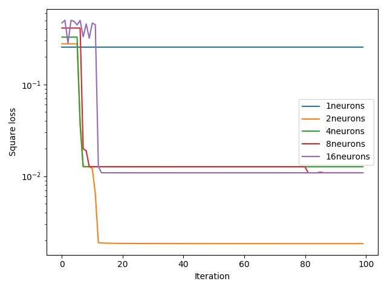|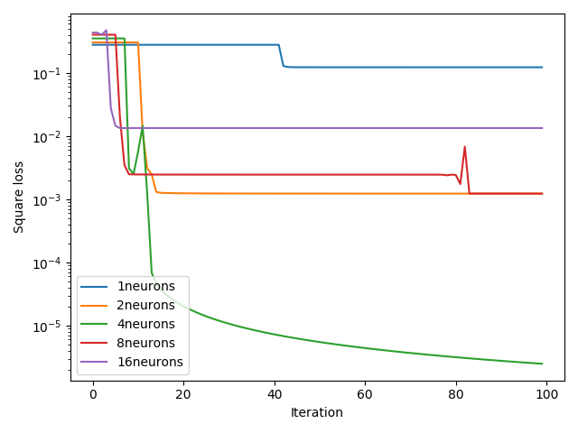|
|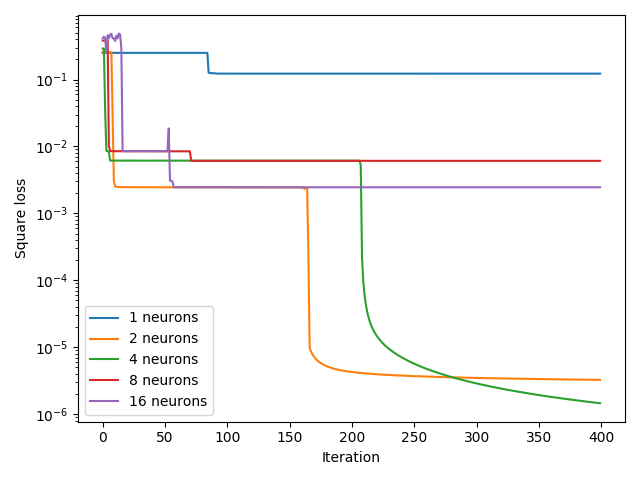|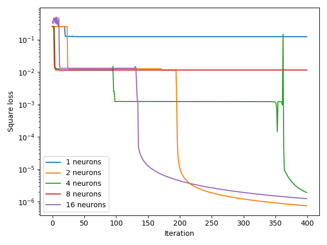|

Widać, że liczba iteracji ma duże znaczenie. Większość wariacji perceptronu zmniejsza stratę dopiero po 100 iteracjach.
Jednak ciężko przewidzieć w którym momencie nastąpi zmniejszenie straty i czy w ogóle nastąpi.

**Modyfikacja perceptronu**

Ponieważ nasz perceptron jest implementacją bazowaną na przykładzie z artykułu powyżej, może zawierać wady, z powodu
możliwych uproszczeń przyjętych w artykule.

Z tego powodu następujące zmiany powinny zbliżyć naszą implementacje do modelu przedstawionego na wykładzie:
- neuron warstwy wyjściowej jest liniowy (nie obliczamy funkcji aktywacji dla niego). 
- odpowiednie zmiany propagacji wstecznej

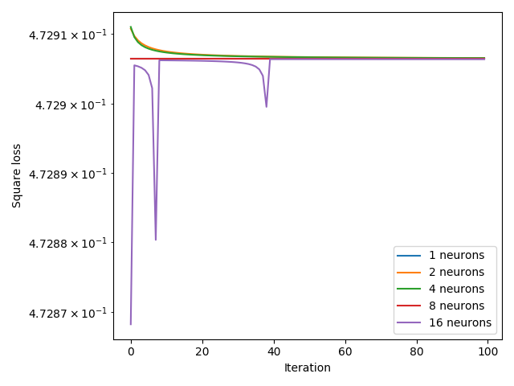

- Strata prawię się nie zmienia dla wszystkich wariacji perceprtonu i wynosi w przybliżeniu 0.4729.
- W czasie działania programu dostaliśmy warning o nadmiarze zauważonym przy obliczaniu funkji aktywacji:
(RuntimeWarning: overflow encountered in exp:
  return 1 / (1 + np.exp(-x)))
  
Okazuje się, że po usunięciu funkcji aktywacji (i jej pochodnej w propagacji wstecznej) pochodna
po wagach staje się zbyt duża, co skutkuje tym, że wartości bezwzględne wag stają się zbyt duże
i powodują powstanie nadmiaru przy obliczaniu funkcji aktywacji.

Chcemy mieć kontrolę nad tym jak szybko zmieniają się wagi. Wprowadzamy tzw współczynnik uczenia.
Teraz pochodne straty zanim dodać do wag przemnażamy przez ten parametr. Dla początku przyjęliśmy
współczynnik uczenia równy 0.1.

|||
|---|---|
|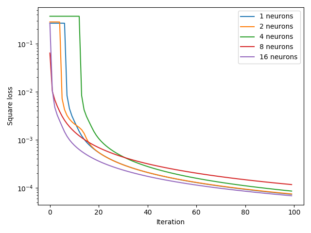|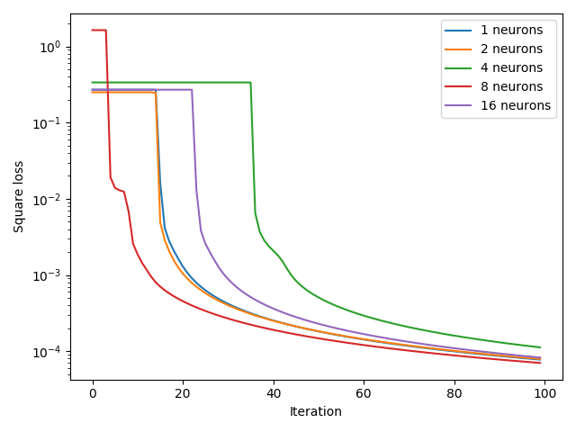|
|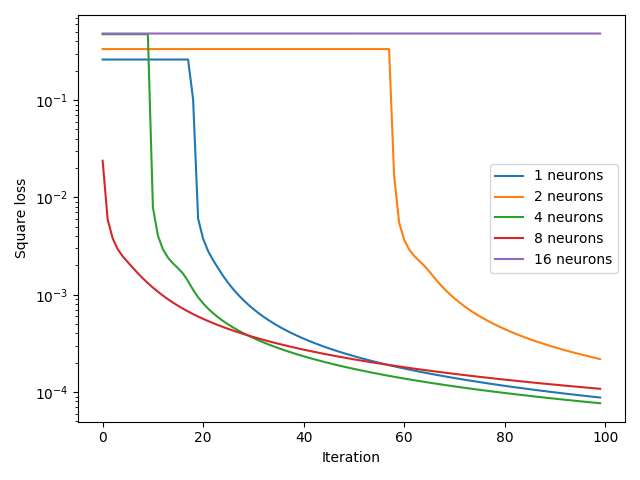||

- obserwujemy    wyraźne poprawienie sprawności
- zauważalny jest wpływ losowości początkowych wag

**Inicjowanie wag**

Wolimy zmniejszyć do minimum negatywny wpływ losowości wag.
- inicjujemy wagi neuronu wyjściowego zerami zamiast robić to losowo
- wagi neuronów ukrytych losujemy z rozkładu jednostajnego z przedziału (-1/sqrt(n), 1/sqrt(n)), 
gdzie n - wymiar wymiar wejścia neuronu

|||
|---|---|
|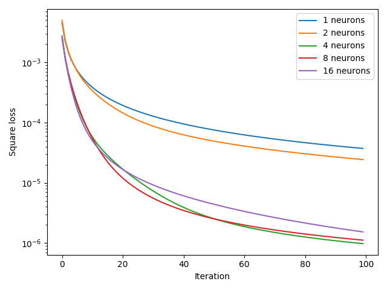|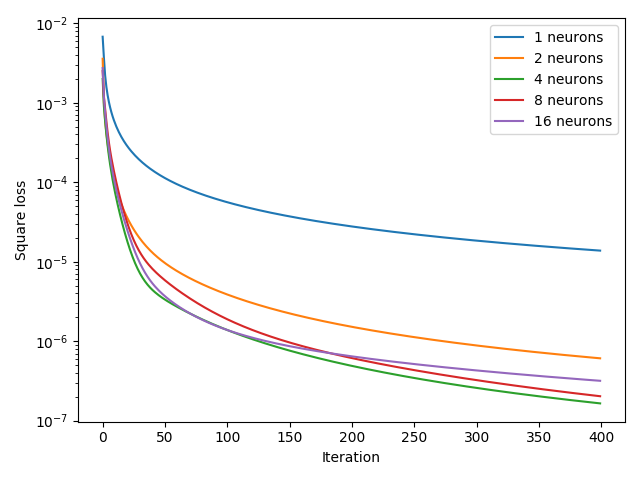|

- obserwujemy bardzo dobry rezultat
- perceptron natychmiast zaczyna poprawiać stratę dla wszystkich badanych wariacji
- perceptron z 1 i 2 neuronami uczy się wolno w porównaniu z innymi
- perceptron z 16 neuronami już nie poprawia wyniku w porównaniu z 4 czy 8 neuronami

**Zależność sprawności perceptronu od współczynnika uczenia**

Porównamy jak zachowuje się strata dla perceptronu z 4 neuronami dla różnych współczynników uczenia

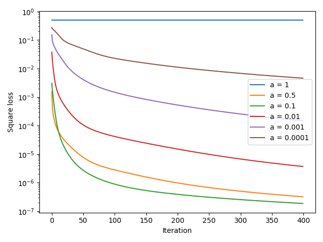

- zbyt mały współczynnik uczenia powoduje, że sieć uczy się zbyt wolno
- zbyt duży współczynnik skutkuje zbyt częstymi błędami sieci, a więc dużą stratą

Porównanie współczynników uczenia 0.07, 0.1 oraz 0.3

| 4 neurony | 8 neuronów |
|---|---|
| 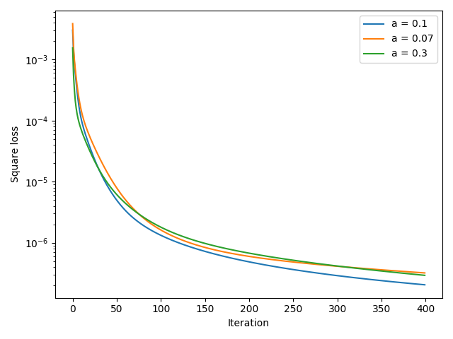 | 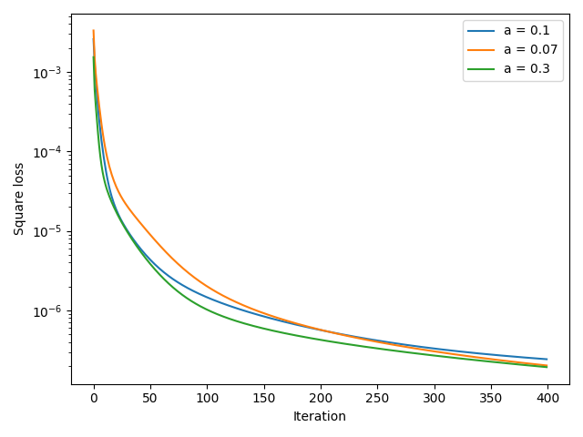 |

- współczynniki jakości pokazują porównywalny rezultat
- postanowiliśmy w dalszych eksperymentach używać wartości 0.1

**K-krotna walidacja krzyżowa**

Dla ulepszenia jakości uczenia i oceniania sieci wprowadzamy metodę k-krotnej walidacji krzyżowej. 
Rysunek poniżej ilustruje w jaki sposób dzielone są dane wejściowe.

Początkowy zbiór dzielony jest na:
- zbiór walidacyjny, na którym sieć się nie uczy, sprawdzamy na nim poprawność sprawność sieci
- zbiór przetwarzany przez sieć metodą k-krotnej walidacji

Tabela poniżej pokazuje liczbę poprawnie przewidzianych odpowiedzi i odpowiednie parametry sieci

| Liczba iteracji uczenia | Liczba neuronów | Współczynnik uczenia | Stosunek zbiorów treningowy:testowy:walidacyjny | Poprawne odpowiedzi | Strata |
|:---:|:---:|:---:|:---:|:---:|:---:|
|100|4|0.1|16:4:5|1624/1624|2.168e-07|
|50|2|0.1|16:4:5|1624/1624|1.382e-06|
|10|1|0.1|8:2:5|2708/2708|0.00012544|
|10|1|0.1|2:1:3|4062/4062|0.00030634|
|1|1|0.1|1:1:2|4055/4062|0.00486307|
|1|1|0.001|1:1:2|3662/4062|0.09289285|

Widać, że nawet bardzo słabo nauczona sieć na jednym neuronie potrafi poprawnie 
przewidywać wszystkie próbki ze zbioru walidacyjnego, co mówi o tym, że zależność tego czy grzyb jest
jadalny czy nie od jego parametrów jest bardzo prosta.

**Porównanie perceptronu z funkcją aktywacji na neuronach warstwy wyjściowej i bez niej**

Konfiguracja:

- 4 neurony
- współczynnik uczenia 0.1
- stosunek danych walidacyjnych do pozostałych 1:1
- stosunek danych treningowych do testowych 2:1
- liczba iteracji uczenia na każdym k-krotnym podziale 100
- liczba iteracji uczenia po k-krotnej walidacji 100
- ziarno losowości 1

| |Z funkcją aktywacji|Bez funkcji aktywacji|
|:---:|:---:|:---:|
|**Strata uśredniona testowa**|4.84142896e-06|1.69846478e-06|
|**Strata na zbiorze walidacyjnym**|5.49349119e-06|4.38600909e-07|
|**Poprawne odpowiedzi**|**100.0%**|**100.0%**|
|**Wykres zależności straty na zbiorze walidacyjnym od iteracji**|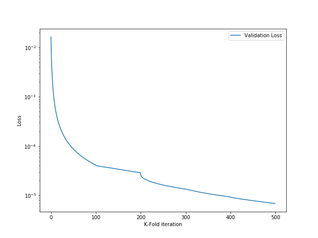|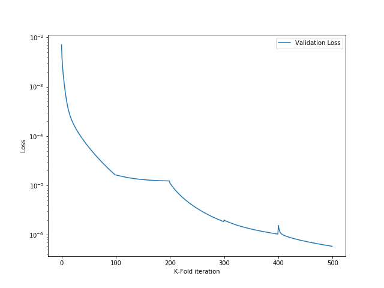|

"Ekstremalne" warunki:
- 1 neuron
- współczynnik uczenia 0.001
- stosunek danych walidacyjnych do pozostałych 1:1
- stosunek danych treningowych do testowych 1:1
- liczba iteracji uczenia na każdym k-krotnym podziale 100
- liczba iteracji uczenia po k-krotnej walidacji 100
- ziarno losowości 1

| |Z funkcją aktywacji|Bez funkcji aktywacji|
|:---:|:---:|:---:|
|**Strata uśredniona testowa**|0.1414469073940681|0.010690605358111328|
|**Strata na zbiorze walidacyjnym**|0.12473975|0.00486256|
|**Poprawne odpowiedzi**|**53.18%**|**99.88%**|
|**Wykres zależności straty na zbiorze walidacyjnym od iteracji**|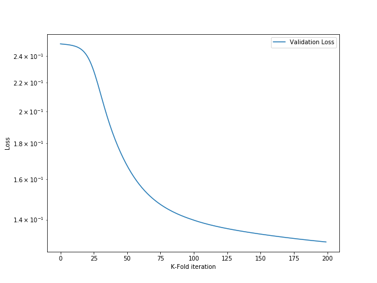|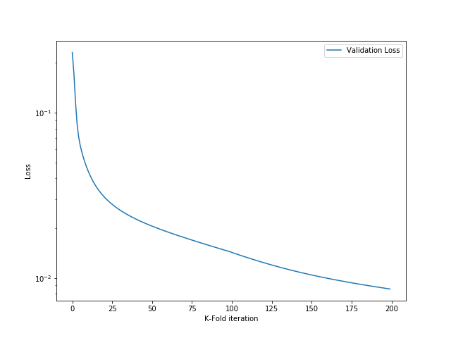|

Perceptron bez funkcji aktywacji na neuronie wyjściowym na ogół wykazuje mniejszą stratę i pokazuje nieco lepsze wyniki
niż w przypadku z funkcją aktywacji.

**Podsumowanie badań**

Pod koniec badań większość wariacji perceptronu pokazywała dobre wyniki i często miała 100% poprawnych odpowiedzi
na zbiorze walidacyjnym. 

Natomiast najmniejszą możliwą stratę wykazuję dana modyfikacja perceptronu:
- 4-8 neuronów
- Współczynnik uczenia 0.1
- Sygmoidalna funkcja aktywacji na neuronach warstwy ukrytej
- Liniowy neuron wyjściowy (bez funkcji aktywacji)
- Losowe inicjowanie wag neuronów warstwy ukrytej z rozkładu jednostajnego (-1/sqrt(n), 1/sqrt(n))
- Inicjowanie wag neuronu wyjściowego zerami

Przy współczynniku k równym 4 bądź 5 dla K-krotnej walidacji krzyżowej.

## Listę wykorzystanych narzędzi i bibliotek
Język programowania
- Python 3

Wykorzystane biblioteki
- [numpy](https://numpy.org/)
- [pandas](https://pandas.pydata.org/)
- [seaborn](https://seaborn.pydata.org/)

Wykorzystane materiały
- https://scikit-learn.org/stable/modules/cross_validation.html
