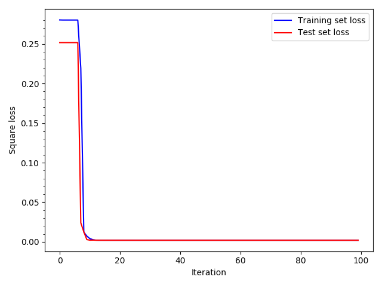
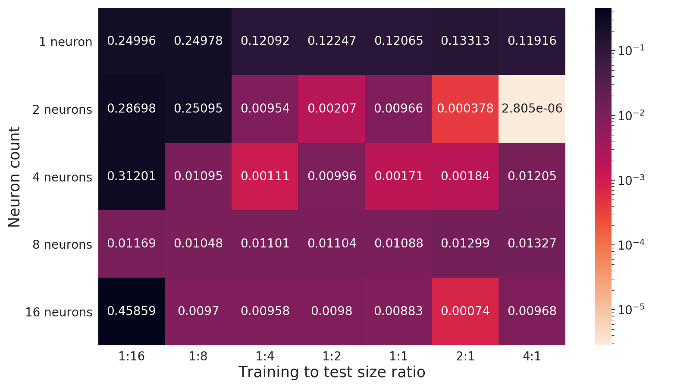
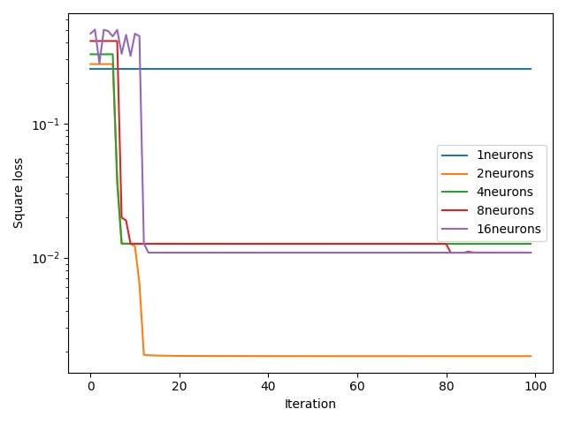
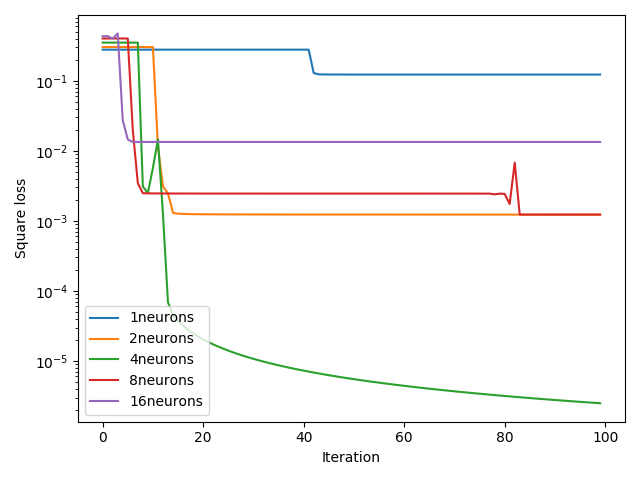
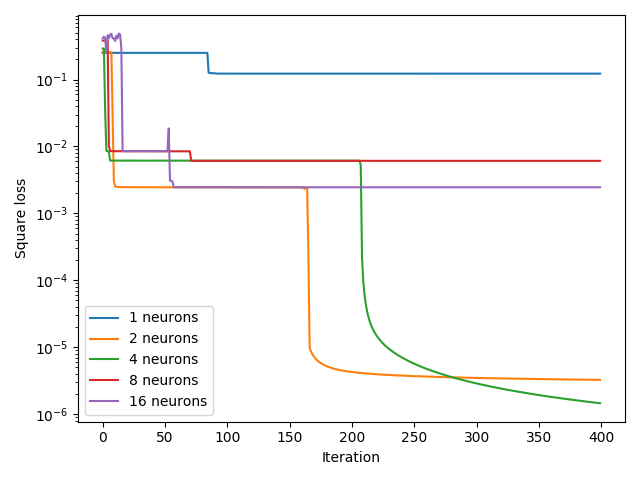
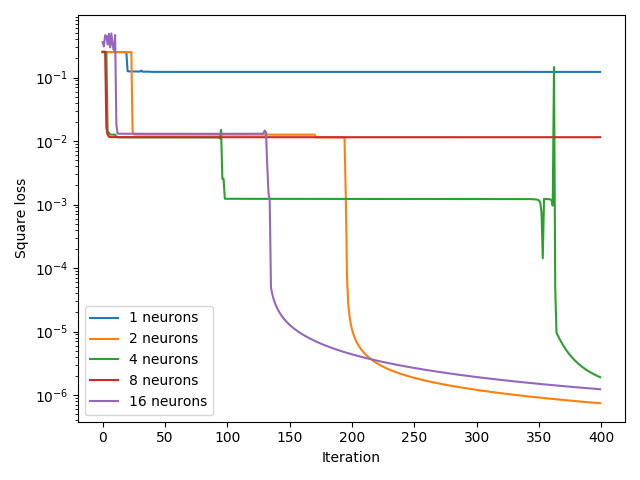

# Projekt z Podstaw Sztucznej Inteligencji - uczenie maszynowe

- Rafal Babinski
- Roman Moskalenko

## Treść zadania `RB.ML12 Grzyby NN`
Przewidywanie czy [grzyb](https://archive.ics.uci.edu/ml/datasets/mushroom) jest jadalny przy użyciu własnej implementacji prostej sieci neuronowej.

## Interpretacja zadania
Mamy pełną swobodę w zaimplementowaniu sieci neuronowej. Wykorzystując podany wcześniej zbiór danych, musimy przeanalizować które komponenty sieci i jakie podejście przy jej budowaniu zapewni jak największą efektywność.

## Wypunktowanie wkładu poszczególnych autorów (kto co zrobił)
Rafal Babinski
Roman Moskalenko

## Decyzje projektowe i przeprowadzone badania
**Decyzje wstępne**
- Wybraliśmy do zaimplementowania prosty lecz efektywny typ sieci neuronowej: perceptron dwuwarstowy
- Jako szablon wstępny wybraliśmy sieć neuronową opisaną w [tym artykule](https://towardsdatascience.com/how-to-build-your-own-neural-network-from-scratch-in-python-68998a08e4f6).
- Uczenie sieci będzie przeprowadzać się z nadzorem.
- Przekodowaliśmy podany zbiór danych na *kod 1 z n* dla zapewnienia działania sieci.
- Arbitralnie wybraliśmy liczbę neuronów w warstwie ukrytej - 2.
- Arbitralnie wybraliśmy funkcję aktywacji - sigmoid.
- Inicjalizacja wag każdego nejronu odbywa się losowo.
- Wartości parametrów bias jest zerowa.
- Stworzyliśmy zbiór danych kontrolnych, 100 wybranych losowo próbek z podanego
 zbioru. Na nim będziemy testować efektywność sieci.
 
**Badanie wstępne**

- Uruchomiono po raz pierszy sieć neuronową. 
- Przez 100 iteracji sieć uczyła się na całym zbiorze danych.
- Przetestowano na losowo wybranych 100 próbkach.

- Przez pierwsze 30 iteracji możemy zaobserwować dużą strate na zbiorze walidacyjnym (czerwona linia).
- Po czym następuje prawie zerowa strata. Mamy podejrzenie, że sieć dopasowała się do danych (przeuczenie sieci).

**Podział zbioru danych na treningowy i testowy**

Aby zapobiec przeuczeniu sieci dzielimy dane na dwa zbiory: zbiór treningowy - uczymy na nim sieć, oraz zbiór testowy - 
na tym zbiorze sprawdzamy efektywność działania sieci.
- Podział danych na treningowe i testowe w stosunku 1:1

- Już na 13 iteracji strata na zbiorze testowym osiągnęła 0.002 (później się okazało to jest duża strata) i utrzymywała się taka w przeciągu pozostałych iteracji.

**Zależność straty od liczby neuronów i podziału danych**

Badamy jak zmienia się strata na zbiorze testowym w zależności od liczby neuronów i stosunku liczności zbioru
treningowego do liczności zbioru testowego.

Straty po 100 iteracjach uczenia

<!--
| | 1:16 | 1:8 | 1:4 | 1:2 | 1:1 | 2:1 | 4:1 | 8:1 |
|---|---|---|---|---|---|---|---|---|
| 1 | 0.24996987 | 0.24978884 | 0.1209201 | 0.12247378 | 0.12065256 | 0.13313197 | 0.11916315 | 0.12001857 |
| 2 | 0.28698771 | 0.25095842 | 0.00954373 | 0.00207549 | 0.00966817 | 3.7384e-04 | 2.80576709e-06 | 2.42590592e-06 |
| 4 | 0.31201701 | 0.01095525 | 0.0011118 | 0.00996514 | 0.00171979 | 0.00184599 | 0.00061646 | 1.6865149e-06 |
| 8 | 0.01169527 | 0.01048587 | 0.01101799 | 0.01104446 | 0.01088784 | 0.01299843 | 0.01327238 | 0.00110838 |
| 16| 0.45859595 | 0.00970373 | 0.00958819 | 0.00980373 | 0.00883177 | 0.00074566 | 0.00968324 | 0.00110679 |
-->
Wnioski z tabeli:
- perceptron z 1 neuronem przy żadnym z podziałów nie pokazał dobrych wyników.
- perceptron z 2 oraz 4 neuronami spradził się nieco lepiej niż perceptrony z 8 i 16.
- perceptron może nauczyć się nawet gdy dane treningowe stanowią połowę lub mniej od całego zbioru
lecz wtedy strata jest porównywalnie duża.
- możliwe, że 100 iteracji to jednak zbyt mało by nauczyć perceptron.

**Porównanie strat dla większej liczby iteracji dla różnej liczby neuronów**

Jeszcze dwa razy uruchomiliśmy sieć dla 100 i 400 iteracji dla podziału danych 4:1.

Wykresy teraz mają skalę logarytmiczną.

|||
|---|---|
|||
|||

Widać, że liczba iteracji ma duże znaczenie. Większość wariacji perceptronu zmniejsza stratę dopiero po 100 iteracjach.
Jednak ciężko przewidzieć w którym momencie nastąpi zmniejszenie straty i czy w ogóle nastąpi.

## Listę wykorzystanych narzędzi i bibliotek
Język programowania
- Python 3

Wykorzystane biblioteki
- [numpy](https://numpy.org/)
- [pandas](https://pandas.pydata.org/)

### Todo
Instrukcję pozwalającą na odtworzenie uzyskanych wyników.
Cele i tezy przeprowadzonych badań, np. celem tego eksperymentu jest zbadanie wpływu zmiany rozmiaru populacji na wynik optymalizacji. Zakładamy, że wraz ze zwiększeniem rozmiaru populacji rosła będzie jakość uzyskanych wyników.
Wyniki eksperymentów w postaci czytelnych tabel i/lub wykresów.
Omówienie wyników eksperymentów. (co widać)
Wnioski
